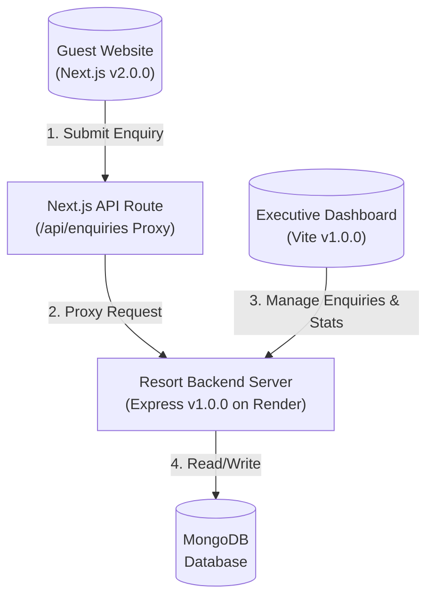

# Jalashay Resort — Website & Booking Ecosystem

> **Release Version**: `v2.0.0`  
> **Integrated Components**: Connects **Resort Backend `v1.0.0`** with **Executive Dashboard `v1.0.0`**

Welcome to the central repository for **Jalashay Resort**. This ecosystem provides a premium lakeside resort guest experience (Next.js Application), an administrative portal (Executive Dashboard) for tracking enquiries, and a centralized management API (Resort Backend).

---

## 🏗️ Ecosystem Architecture

The application is split into three main components:

1. **Guest Web Application (This Repo - `v2.0.0`)**: Next.js App Router frontend displaying guest information, room views, amenities, reviews, and a booking enquiry form.
2. **Resort Backend (`v1.0.0`)**: Node.js/Express API deployed on Render that processes booking inquiries, manages users/sessions, and persists data to MongoDB.
3. **Executive Dashboard (`v1.0.0`)**: Vite-powered Single Page Application (SPA) used by the resort's administration to view, manage, and filter enquiries, check booking status, and update revenue stats.

### Data & Request Flow



---

## ⚡ Tech Stack

### Guest Web Application (v2.0.0)
* **Framework**: Next.js 15 (App Router, Tailwind CSS v4, TypeScript)
* **Animation**: Framer Motion (smooth page transitions, morphing logo effects)
* **Form & Validation**: React Hook Form + Zod
* **Icons & Feedback**: Lucide React + Sonner

### Executive Dashboard (v1.0.0)
* **Framework**: React 19 + Vite + Tailwind CSS v4 + TypeScript
* **State & Fetching**: TanStack React Query v5 + React Router DOM
* **Components**: Custom Radix-based UI components (dialogs, tables, calendars, popovers)

### Backend Service (v1.0.0)
* **Framework**: Node.js + Express
* **Database**: MongoDB (Mongoose ODM)
* **Hosting**: Render (Cloud Platform)

---

## ⚙️ Environment Configuration

To run the ecosystem locally, set up the following environment files:

### Guest Web Application (`.env` or `.env.local` in this directory)
```env
# Port/address of the backend API (local or production Render server)
NEXT_PUBLIC_API_URL=backend_url

# Direct link for mobile guest inquiries
NEXT_PUBLIC_WHATSAPP_NUMBER=xxxxxxxxxx
```

### Executive Dashboard (`.env` or `.env.local` in the dashboard folder)
```env
# API Endpoint for administration auth and data sync
VITE_API_URL=backend_url
```

---

## 🚀 Getting Started

### 1. Prerequisite Installations
Ensure Node.js `20.19+` or `22.12+` and `npm` are installed.

### 2. Guest Website Setup (This Repo)
```bash
# Clone the repository
git clone https://github.com/sumit783/jalashy_resort.git
cd jalashy_resort

# Install dependencies
npm install

# Run the development server
npm run dev
```
Open [http://localhost:3000](http://localhost:3000) to view the resort web app.

### 3. Executive Dashboard Setup
Navigate to the dashboard repository:
```bash
cd jalashy_resort_executiveDashboard

# Install dependencies
npm install

# Run the dashboard development server
npm run dev
```
Open [http://localhost:5175](http://localhost:5175) to access the administrator panel.

### 4. Build Configurations
To build the projects for production:

* **Resort Web App**:
  ```bash
  npm run build
  ```
* **Executive Dashboard**:
  ```bash
  npm run build
  ```
  *(Note: Vercel SPA routing is configured automatically inside `vercel.json` to handle React Router client side paths.)*

---

## 🎨 Visual Identity & Assets

The application's theme leverages custom **OKLCH Color Space** definitions featuring dark, warm charcoal backgrounds (`oklch(0.16 0.012 60)`) paired with elegant gold gradients (`--gradient-gold`).

* **Favicon & Logos**:
  * Guest Website: Managed in Next.js metadata `/public/Jalashay_Logo.webp`.
  * Executive Dashboard: Managed in Vite assets `/src/assets/Jalashay_Logo.webp` and referenced in index headers.